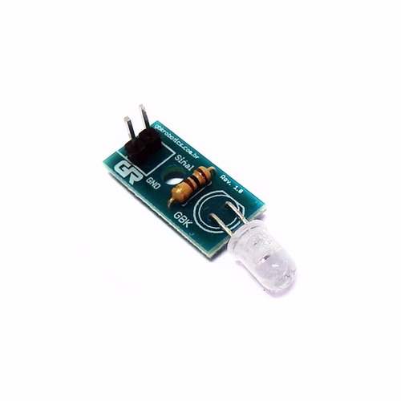

# Roomba Virtual Wall with Raspberry Pico
This is the implementation of the Roomba Virtual Wall on Raspberry Pico using Micropython.   
That was properly tested in my Roomba 690.

## Requirements
- Micropython
- Raspberry Pico
- IR Transmitter   
  In my case, I used the one below, but it should work with others out of the box.

  

## Dev environment
To setting up your environment, you case use https://github.com/cpwood/Pico-GO

## Reference
https://sites.google.com/site/irobotcreate2/createanirbeacon